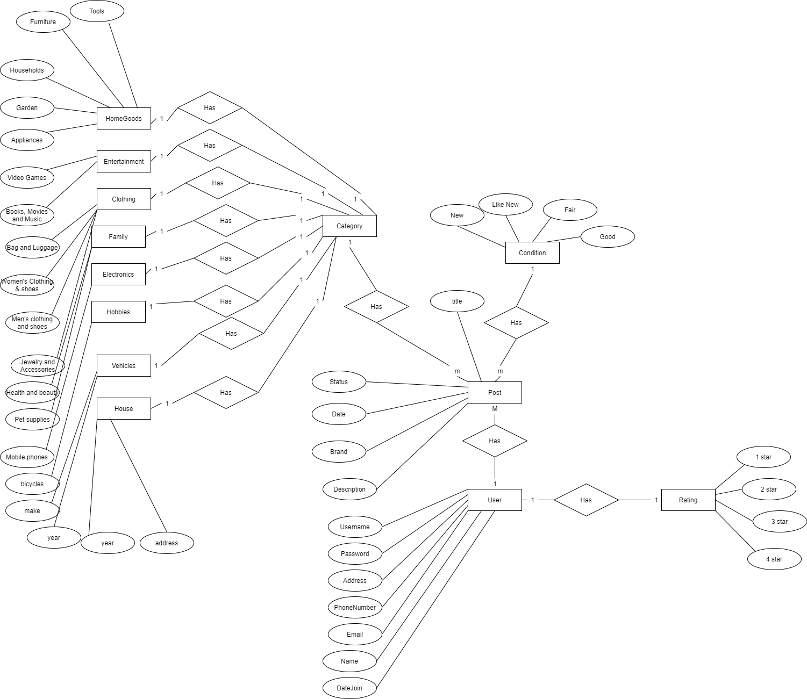
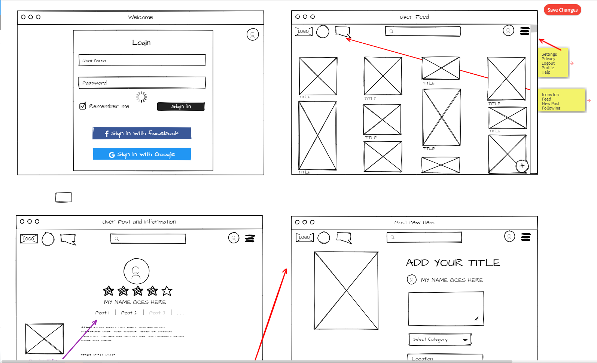
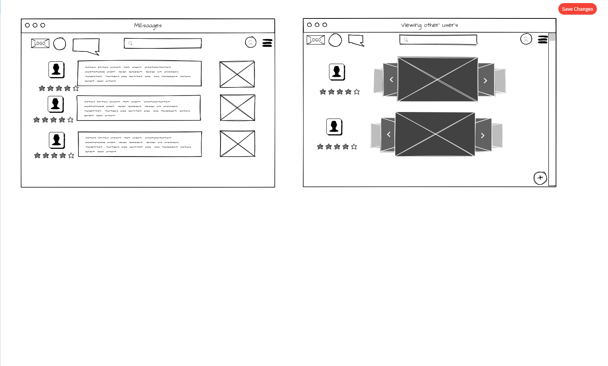

# BobbyPin
Cloud application to trade new and used items

### Table of contents
|Table|
|---------------------------|
| [Inspiration](#inspiration)|
| [Concept](#concept)  |
| [Database Diagram](#database-diagram) |
| [Entity Relationship Diagram](#entity-relationship-diagram) |
| [User stories](#user-stories)  |
| [Use-cases](#use-cases)  |
| [Use-case diagram](#use-case-diagram)  |
| [Requirements](#requirements) |
| [Wire Frame](#wire-frame)|

## Inspiration
[(back to top)](#table-of-contents)
 
I was inspired to build this application because I love shopping and I hate spending money, so I wanted a platform where I could use to trade items I already had in my possession. I was also inspired by the TikTok video circulating the internet of a girl on a mission to trade a bobby pin for a house.

## Concept
[(back to top)](#table-of-contents)
 
The concept of this application is to have a platform for people to trade items without having to spend any money. This application will be reliable because you can have direct contact with other users without having to use a third-party service. This allows for privacy and the protections of personal information. The application also allows for users to give a rating to other users to have more reliable trades and therefore make better trading decisions.

## Database Diagram
[(back to top)](#table-of-contents)

 

## Entity Relationship Diagram
[(back to top)](#table-of-contents)
 

## User Stories
[(back to top)](#table-of-contents)

1. As a user, I want to invite my friends So that we can enjoy this service together
	
2. As a user, I want to register to the application by entering my email, password, and confirming my password so that I can have an account
	
3. As a user, I want to receive a confirmation email once I have registered for the application so I can be authenticated
	
4. As a user, I want to upload a profile picture photo and add my name to my account, so I can have my own personalize account
	
5. As a user, I want to log into the application by entering my email and password, so I can retrieve my saved information 
	
6. As a user, I want to reset my password if I have forgotten my password so I can log in to my account
	
7. As a user, I want to edit my personal information so I can have it up to date
	
8. As a user, I want to update my email and receive email confirmation, so I can verify my identity
	
9. As a user, I want to logout of the application from my account, so I do not get hacked
	
10. As a user, I want to be able to post an item, so the public can see it
	
11. As a user, I want to be able to change the status of my post, so the public can know the availability of it.
	
12. As a user, I want to be able to edit my post, so I can have the most up to date information
	
13. As a user, I want to be able to receive private messages directly to me, so I know if another user is interested in my post
	
14. As a user, I want to be able to delete my post, so in case I do not want the post to go live
	
15. As a user, I want to contact other users via instant messaging, so I can trade my item
	
16. As a user, I want to delete the conversations, so I can keep the most relevant messages
	
17. As a user, I want to rate other users when I trade an item with them, so the public knows how trustworthy they are.
	
18. As a user, I want to search for items, so I filter out what I do not want.
	
## Use-Cases
[(back to top)](#table-of-contents)
1.  A user invites friends to the application
  * the user clicks on the share button
  * the user enters their friend's information
  * the system sends a link to the user's friend
2. register to the application by entering my email, password, and confirming my password
  * The system asks for an email, password, and password verification
  * the User enters their email, password, and password verification
  * the user clicks enter
  * the system stores the data and creates a new account for the user
3. receive a confirmation email once registered to be authenticated
  * The system will email the user with a hyperlink to authenticate the user
  * the user must click on the link to be authenticated
  * the link lets the system authenticate the user
4. upload a profile picture photo and add my name to the account
  * The user clicks on my account
  * the user clicks on update my account
  * the user updates his picture or name
  * the user clicks on save changes
  * the system updates the changes made 
5. log into the application by entering an email and password
  * A registered user can enter an email and password to the home page
  * The system will take the user to their account if the user exists
6.  reset my password if forgotten password
  * The user will click on a link to reset password
  * the user will enter the email linked to their account
  * the system will email the user a link to reset the password
  * the user will click on the link and reset their password
  * the user will be directed to try logging in again with the new password
  * the user will be taken to their account if the password and email match
7.edit personal information 
  * the user will click on my profile
  * the system will take the user to their profile 
  * the user will click on update my profile
  * the user will update any information necessary
  * the user will click save changes
  * the system will save the changes
8. update my email and receive email confirmation
  * The user will update their email by clicking on my profile
  * the system will take the user to their profile
  * the user will click update my profile
  * the user will update their email
  * The user will be required to enter their password in order to successfully change their email.
  * the user will click save changes.
  * If the password is correct, the system will save the changes and send an email to both emails notifying of the change in email.
9. logout of the application from my account
  * The user will click on my account
  * the user will click on logout
  * the system will securely log the user out
  * the system will take the user to the login page
10. post an item
  * The user will click on the add icon
  * the system will take the user to the add post page
  * the user will fill out all the information
  * the user will click review
  * the system will show the user a preview of the post
  * the user can make changes or post 
  * the user will post the item to the public
11. change the status of my post
  * The user will be able to click change status of their post
  * the user will change the status
  * the user will click save changes
  * the system will ask for confirmation
  * the system will change the color of the post and display the current status
12. edit post
  * the user will click on edit my post
  * the system will load the edit page
  * the user will make the changes
  * the user will click save changes
  * the system will update the changes
  * the system will display to post with the current changes.
13. private messages directly
  * the user will receive messages regarding their post
  * the system will show the messages on their inbox
14. delete my post
  * the user will be able to delete any of their post
  * they will click delete post
  * the system will confirm with the user of their action
  * the user will click confirm
  * the post will be deleted forever
15. contact other users via instant messaging
  * the user can click on their inbox
  * the user can create a new message
  * the user can send a new message
  * the system will send the message to the corresponding user
  * the history of the messages will be saved
16. delete the conversations
  * the user can delete any conversation by clicking on the delete conversation.
  * the system will confirm with the user about their action
  * the user will confirm
  * the conversation will be deleted 
17. rate other users
  * the system will ask the user if they want to rate the user, they traded the item with
  * the user can give 0-4 stars
  * the user can also add a review
  * the system will save the rating
  * the system will also average the rating with the all the rating of the user 
18. search for items
  * the user will be able to click on the search for items
  * the user can search by keywords, area, or category
  * the system will filter the results according
  * the system will display the results
  * the user can scroll through the results.
	
## Use Case Diagram
[(back to top)](#table-of-contents)
[link to Diagram!](https://drive.google.com/file/d/1ummeJVcx5IyfRwJ9z19i3AaOEwfzJHYj/view?usp=sharing) 

## Requirements
[(back to top)](#table-of-contents)
1. Login 
1.1 The system shall be able to check if password and email match 
1.2 The system shall be able to allow the user to recover a password or email 
1.3 The system shall be able to allow user access if the password and email match 
2. Change password 
2.1 the system shall be able to update the new password 
2.2 the system shall be able to verify the user by email 
2.3	the system shall be able to allow the user to login with the new password 
3. Update profile 
3.1 the system shall be able to update any information of the user's account 
3.2 the system shall be able to retrieve the updated information 
3.3 the system shall be able to display the updated information 
4. Post item 
4.1 The system shall be able to store the information of the post 
4.2 the system shall be able to retrieve all the information of the post 
4.3 the system shall be able to modify any information of the post 
5. Messaging 
5.1 The system shall be able to create a new conversation 
5.2 the system shall be able to show the new messages 
5.3 the system shall be able to delete the conversations 
6. rate users 
6.1 the system shall be able to average the ratings 
6.2 the system shall be able to display the rating 
6.3 the system shall be able to store the rating  
7. logout	 
7.1 the system shall be able to end the session 
7.2 the system shall be able to save the information 
7.3 the system shall be able to recover information when not properly logged out 
8. Sharing application 
8.1 The system shall be capable of 23 users 
8.2 the system shall be able to open in any device 
8.3 the system shall be user friendly 
9. qualifications 
9.1The system shall be user friendly 
9.2 the system shall be used by non-technical users, and this must be simple and easy to use 
9.3 the system shall require little training 
	
 
 

|Test Priority: Med|
|Title: Verify a password change|
|Description: Ensure that if a user forgets their password they are able to reset their password.|

|1.3 Unit Test Change Profile|
|----------------------|
|Req ID: 3.1|
|Test Priority: low|
|Title: Update user demographics|
|Description: ensure that the data is up-to-date when a user decides to modify it.|

|1.4 Unit Test Post Is Live|
|----------------------|
|Req ID: 4.1|
|Test Priority: high|
|Title: Post is live|
|Description: Verify that any item that a user post is visible to other users. |

|1.5 Unit Test New Conversation |
|----------------------|
|Req ID: 5.1|
|Test Priority: Med|
|Title: Messaging |
|Description: Ensure the user can create a new conversation with another user|

|1.6 Unit Test Rating Users|
|----------------------|
|Req ID: 6.1|
|Test Priority: Low|
|Title: Verify the rating feature|
|Description: Ensure the rating feature works when a user is asked to rate a user.|

|1.7 Unit Test Change Password|
|----------------------|
|Req ID: 7.1|
|Test Priority: Med|
|Title: Verify a user can logout|
|Description: Ensure a user is logouted if they click logout |

|1.8 Unit Test Change Password|
|----------------------|
|Req ID: 8.1|
|Test Priority: Low|
|Title: Verify the application can be shared|
|Description: Does the button to share the application work when a user shares it with their friends|

|1.9 Unit Test Change Password|
|----------------------|
|Req ID: 9.1|
|Test Priority: low|
|Title: Verify qualifications|
|Description: Test to see if all features can go back to the homepage without extra steps. test usability|

## Wire Frame
[(back to top)](#table-of-contents)

